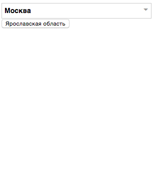

# События
Синтаксис, делегирование, создание событий, способы вызова и пр. По этому материалу есть [домашнее задание](./#-homework-)

## Obtrusive vs. Unobtrusive
Так делать нельзя: `<button onclick="alert('Hello')">Say hello</button>`.

* Плохо поддерживать
* Плохо расширять 

Нужно пользоваться только ивент-листнерами.

## .on
Основной способ навесить события — `.on()`. У него есть удобные алиасы: `.click()`, `.blur()` и т. д. Некоторые из 
них позволяют обработать похожие события минимальными усилиями. Например, `.hover()`
[может сразу](https://api.jquery.com/hover/) взять на себя `mouseenter` и `mouseleave`:

```javascript
$( "#menu li" ).hover(
    function() {
        $( this ).css( {
             background: 'red'
         });
     },
    function() {
        $( this ).css( {
             background: ''
         });
     }
});
```

Если в `.hover()` передать одну функцию, то она сработает и на `mouseenter` и на `mouseleave`.

Сами `jQuery` [рекомендуют](http://learn.jquery.com/events/introduction-to-events/#ways-to-listen-for-events) всегда 
использовать `.on`, потому что так работает быстрее и код выглядит более консистентно (всегда однотипен).

Через `.on()` можно:
* обработать разные события одной и той же функцией
* передать данные в функцию обработчик
* работать с кастомными событиями
* или передать объект нескольких событий и обработчиков

`.on()` будет работать на элементах, которые уже существуют в документе на момент назначения. Новые аналогичные  
элементы не будут иметь этого обработчика.

## this
`this` внутри функции обработчика — это элемент, который вызвал событие (triggered event). В качестве аргумента функция-обработчик получает объект события:

```js
$('button').on('click', function(event) {
    console.log(this); // DOM-элемент, не jQuery object (нужно оборачивать в $)
    console.log(event); // Объект события
});
```

Про `this` можно почитать [тут](http://learn.javascript.ru/object-methods).

## Неймспейсы событий
Для того, чтобы снимать события пачками, можно им добавлять неймспейсы:

```javascript
$(document).on('mousemove.slider', function() {});
$(document).on('mouseup.slider', function() {});
// ...
$(document).off('.slider'); // Снять все события в неймспейсе
```
    
## Удаление обработчиков
Удалить можно все обработчики события:

```javascript
$('p').off('click');
```

Или все события из неймспейса:

```javascript
// Создаем
$( "p" ).on( "click.myNamespace", function() { /* ... */ } );
$( "p" ).on( "mouseenter.myNamespace", function() { /* ... */ } );
// Удаляем
$( "p" ).off( "click.myNamespace" ); // Только клики
$( "p" ).off( ".myNamespace" ); // Unbind all events in the namespace
```
    
Удалить можно и обработчик, назначенный через именованную функцию:

```javascript
var foo = function() { console.log( "foo" ); };
var bar = function() { console.log( "bar" ); };
$( "p" ).on( "click", foo ).on( "click", bar );
$( "p" ).off( "click", bar ); // foo is still bound to the click event
```

## Исполнить событие только раз
Если нужно, чтобы событие сработало только один раз, а потом перестало работать или обработчик при последующих таких 
же событиях был другим, можно использовать `.one()`.

Это бывает полезно, если нужно при первом действии выполнить какую-то инициализацию, которая сохраниться для 
последующих манипуляций. Напирмер, сгеренить разметку для выпадалки кастомного селекта при первом клике и назначить 
на него обработчики для последующих кликов. Если на него так ни разу и не кликнули, то и делать ничего не будем: DOM 
не засоряем, ивенты не навешиваем.

[Пример](examples/one.html) сработает отдельно для каждого параграфа:

```javascript
$( "p" ).one( "click", firstClick );
function firstClick() {
    console.log( "You just clicked this for the first time!" );
    $( this ).click( function() { console.log( "You have clicked this before!" ); } );
}
```
    
Если в обработчик навесить сразу на несколько событий, то он будет работать для каждого события в отдельности:

```javascript
$( "input[id]" ).one( "focus mouseover keydown", firstEvent);
function firstEvent( eventObject ) {
   console.log( "A " + eventObject.type + " event occurred for the first time on the input with id " + this.id );
} 
```

## Делегирование
Для того, чтобы указать, на каком именно элементе нужно обработать событие, используют делегирование.

Прицип: слушаем не сам элемент, а его родителя, но обработчик вешаем на нужный нам элемент.

Пример: Список товаров. У всех кнопка купить. Нужно обработать каждую кнопку в контексте товара (элемент списка, своя цена, свой урл, своя картинка):

```html
<ul class="products">
    <li class="product js-product">
            
        <button class="product__buy" data-price="120">Купить</button>
    </li>
</ul>
```

```js
$('.js-product').on('click', '.product__buy', function(event) {
    // TODO: Нужно ли давать класс js-buy кнопке, если обработчик
    // навешен на li? Или обращаться тут по .product__buy?
    var price = $(this).data('price');
    buyProduct(price); // функционал покупки
});
```

[Делегирование событий](http://learn.javascript.ru/event-delegation).

Есть 2 вида синтаксиса, работают инентично. Первый, где передается объект, в котором событие — свойство:

```javascript
$( "body" ).on({
    click: function( event ) {
        alert( "Hello." );
    }
}, "button" );
```

И второй, где событие — строка:
     
```javascript
$( "body" ).on( "click", "button", function( event ) {
    alert( "Hello." );
});
```

Второй использовать предпочтительнее.

## Именованные функции-обработчики
Нужно помнить, что [повторять код — плохо](https://en.wikipedia.org/wiki/Don%27t_repeat_yourself). Если какие-то действия нужно производить для разных событий, то лучше вынести обработчик в отдельную функцию вместо анонимной. Эта
функция получит объект события:

```javascript
function helloEvent( event ) {
    alert( "Hello " + event.type );
}
$( "#helloBtn" ).on( "click", helloEvent );
$( "#helloLink" ).on( "click", helloEvent );
```

TODO: обработчики как методы объекта, передача контекста объекта (binding this) внутрь обработчика.

## Объект события
[Расширенный объект события](examples/event_object.html) передается в функцию-обработчик. Он содиржит `event.originalEvent` — событие, которое генерит сам браузер (может быть иногда полезно, например, для тач-устройств).

`event.preventDefault()` — отключить поведение браузера по умолчанию. Удобно использовать, когда нужно, чтобы по клинку не переходить по ссылке или не сабмитить форму, навесив собственный обработчик.

`event.stopPropagation()` — прекратить всплытие события. Чтобы кликнув на ссылке, клик не срабатывал на родительских элементах.

## Передача данных
Часто при обработке события нужно обработать и показать какие-то данные, которые характерны для элемента, на котором событие сработало. Обычно эти данные достаются из базы или как-товычисляются на сервере.

:shit: Есть искушение сделать глобальную переменную прямо в html-коде, но так делать нельзя. Сложно поддерживать (код раскидан по проекту), велика вероятность переопределения глобальной переменной. Отстой, короче.

Для этих целей подойдет html-атрибут `data-<name>`:

```html
<button data-price="100">Buy</button>
```

```js
$('button').on('click', function() {
    console.log('$' + $(this).data('price')); // $100
});
```

Данные так же можно передавать непосредственно в обработчик при создании:

```javascript
$( "p" ).on( "click", {
    foo: "bar"
}, function( event ) {
    console.log( "event data: " + event.data.foo + " (should be 'bar')" );
});
```

## Несколько событий, один обработчик
[Пример](examples/multiple_events.html)
Так будет оптимальнее, потому что экономятся ресурсы (?): 

```javascript
$( "div" ).on( "mouseenter mouseleave", function(e) {
    console.log( "mouse hovered over or left a div" );
    if ( e.type == 'mouseenter') { ... }
});
```
    
## Несколько событий, много обработчиков
Так более читаемо, но создаются методы, которые можно и не создавать:

```javascript
    $( "div" ).on({
        mouseenter: function() {
            console.log( "hovered over a div" );
        },
        mouseleave: function() {
            console.log( "mouse left a div" );
        },
        click: function() {
            console.log( "clicked on a div" );
        }
    });
```
    
## Вызов события из кода
`.trigger()` позволяет имитировать событие на элементе с обработчиком `.on`. Оне работает только с 
jQuery-обработчиками, нативные событие триггерить так не получится:

```javascript
<a href="http://learn.jquery.com">Learn jQuery</a>
<script>
    // Ничего не произойдет
    $( "a" ).trigger( "click" );
</script>
```

Для лучшей читаемости кода, если нужно передать какие-то данные вместе с вызовом события, рекомендуется использовать 
расширенный синтаксис:

```javascript
$( "body" ).trigger({
  type: "logged",
  user: "foo",
  pass: "bar"
});
```

Если надо вызвать нативное событие, то можно воспользоваться [document.createEvent](https://developer.mozilla.org/en-US/docs/Web/API/Document/createEvent).
Есть еще плагин [jquery.simulate](https://github.com/jquery/jquery-simulate/). Он триггерит и нативные и jQuery-события.

### .trigger() vs .triggerHandler()
Отличия:

1. Запуск дефолтных обработчиков браузера (не те, которые мы пишем, а внутренние, типа сабмита формы).
`triggerHandler` их не запустит, `trigger` запустит.

2. Запуск обработчика на коллекции:
`triggerHandler` запустит только на первом элементе, `trigger` запустит на всех элементах коллекции.

3. Возвращаемое значение:
`triggerHandler` вернет результат обработчика, `trigger` вернет элемент, на котором сработало событие (можно 
использовать в цепочке).

4. Всплытие:
`triggerHandler` не запускает всплытие, `trigger` запустит всплытие, сработают обработчики на парентах. [Подробнее](http://learn.javascript.ru/event-bubbling)  о всплытии событий.

Вывод: используем `triggerHandler`, если не нужны фишки `trigger`.

**Триггер события для запуска какого-то функционала**
Так делать не рекомендуется. Если, например, на клик кнопки показывается попап, а нам его нужно показать программно, то
не стоит просто триггерить событие на первой кнопке, для показа попапа. Нужно вынести этот код в отдельную функцию и 
запускать отдельно.

[Пример](examples/triggers.html):

```javascript
// Triggering an event handler the right way
var foo = function( event ) {
   if ( event ) {
       console.log( event );
   } else {
       console.log( "this didn't come from an event!" );
   }
};
$( "p" ).on( "click", foo );
foo(); // instead of $( "p" ).trigger( "click" )
```

## Кастомные события
Событийно-ориентированный подход к реализации интерфейсов сменяет фокус с элемента, который событие запускает, на 
элемент, на котором оно срабатывает (над которым выполняется действие).

Преимущества:
* Один раз пишем код для поведения, триггерим его из разным мест столько, сколько нужно.
* За один подход можно запустить обработчик для разных, похожих и одиночных элементов (?)
* Код закреплен за целевым элементом (а не за тем, который запускает обработку), таким образом код проще поддерживать.

В чистом JS есть конструктор `CustomEvent`.

## Домашнее задание [](#homework)
Имеется объект с названиями регионов и их идентификаторами:

```javascript
var regions = {
    485: "Москва",
    523: "Владимирская область",
    530: "Калужская область",
    536: "Ленинградская область",
    486: "Московская область",
    549: "Рязанская область",
    563: "Санкт-Петербург",
    554: "Смоленская область",
    556: "Тверская область",
    558: "Тульская область",
    562: "Ярославская область"
};
```

Нужно написать компонент — кастомный селект, который получает этот объект и индентификатор текущего региона (он 
должен быть выбран по в селекте по умолчанию).

Пример инициализации:

```javascript
var select = new Select(regions, selectedId);

// Компонент должен генерировать событие после смены региона:
select.on('change', function(e) {
    alert(e.value);
});

$('#regions').append(select.getElement());
```

Примерный вид и работа компонента. Выбор региона из списка и по клику на кнопке:



Никаких ограничений на внешний вид и синтаксис нет, делайте как считаете нужным. Главное, чтоб код был понятен и 
удобен в использовании.

## Материалы
* http://learn.jquery.com/events/
* http://api.jquery.com/category/events/
* https://learn.javascript.ru/widgets
* https://learn.javascript.ru/task/custom-select
