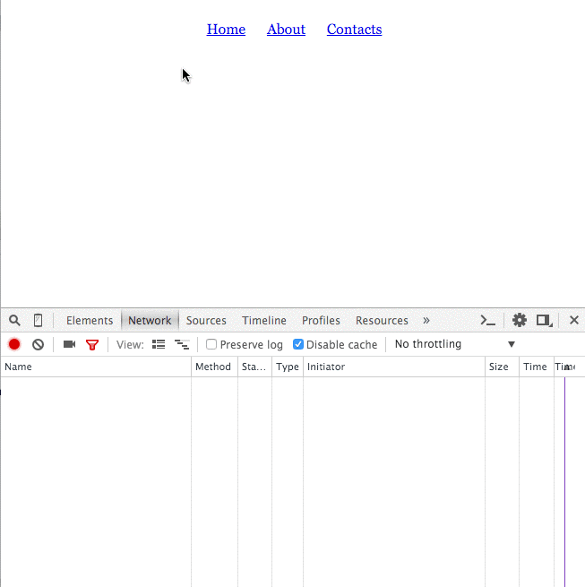

При работе с асинхронными процессами код становится сложнее. Функции обратного вызова (коллбэки) не всегда достаточно
удобны. При использовании колбэков код может быть перегражен вложенными конструкциями и потерей производительности.
Для решения этих проблем придумали механизм отложенного исполнения. В jQuery он реализован с помощь deferred-объектов.
<span class="more"></span>

# Deferred
К объекту с отложенным вызовом обработчиков (deferred-объект) мы можем прикрепить код, который сработает при успешном
или неуспешном выполении действия в будущем.

Deferred — объект для хранения состояния. К каждому состоянию объекта можно прикрепить функционал, выполняемый 
когда-то в 
будущем:

```js
var d = $.Deferred(); // Объект, отвечающий за выполнение чего-то в будущем

/*
    Запускаем процесс, занимающий неопределенное время: аяксовый запрос, таймер, анимация и пр.
    После успешного завершения процесса вызываем d.resolve(DATA).
    Если возникла ошибка, вызываем d.reject(DATA).
    Во время выполнения процесса d находится в стадии `progress'. Это можно увидеть с помощью d.state().
*/

// Сделать это, когда все будет хорошо
d.done(function(value) {
    alert(value)
});

// Сделать это, когда будет ошибка
d.fail(function(value) {
    alert(value);
});

// Сделать это в любом случае
d.always(function(value) {
    alert(value);
});
```

Этот код работает, но наш объект `d` открыт внешнему миру. Любой код, которому доступен `d` может изменить его 
состояние. Это потенциальная проблема. Ее можно решить, ограничив доступ к методам `resolve` и `reject` нашего 
deferred-объекта.

# Promise
Зачастую нам не нужно давать возможность изменять состояние deferred-объекта. Мы чаще хотим просто дать возможность 
прикреплять обработчики. Для этого реализован метод `d.promise()`. Он вернет deferred-объект без возможности 
зарезолвить или зареджектить его. Можно будет только прикрепить к нему обработчики, а менять его будет нельзя.

Метод `$.ajax` возвращает промис. И мы можем наряду с `success` и `error` использовать `.done` и `.fail`. Это 
даст возможность избавиться от вложенных методов и прикрепить несколько обработчиков. Код станет читабельнее и гибче.

```js
var promise = (function () {
    var d = $.Deferred(); // Объект, отвечающий за выполнение чего-то в будущем

    asyncProcess(function() {
        // Прощесс пошел...
        // Если все пройдет успешно, запустим d.resolve();
        // Если будет ошибка, запустим d.reject();
    });

    return d.promise(); // Вернуть не объект d, а ограниченный интерфейс к нему — promise
})();


// Сделать это, когда все будет хорошо
promise.done(function (value) {
    alert(value)
});

// Сделать это, когда будет ошибка
promise.fail(function (value) {
    alert(value);
});

// Сделать это в любом случае
promise.always(function (value) {
    alert(value);
});
```

Promise is a read-only jQuery Deferred object.


# Терминология: Deferred и Promise
Все делает Deferred.

Promise — это неразрушающий интерфейс к объекту Deferred. Лучше не давать внешнему коду лезть в deferred, чтобы ничто 
левое не запустило `resolve` или `reject`. Промис как секретарь фильтрует только неизменяющие 
запросы к deferred. См. [deferred_vs_promise.html](deferred_vs_promise.html)

Мы пришли в ресторан, свободных столов нет. Система ресторана может прислать смс, когда освободится стол, который нам
понравился.

Мы можем заказать стол на будущее. Оставить номер телефона и система сама пришлет нам смс, когда стол освободится.
Официант создаст для нас Deferred, зарегистрировав наш заказ. Но он не пустит нас к компьютеру, чтобы мы не нажали 
кнопку "Стол свободен" раньше времени. Он только добавит наш телефон в систему — это наш единственный интерфейс.

Смс соответствуюет Promise.
Пока стол будет занят, мы можем прогуляться, выпить чего-нибудь в баре, а не тупо стоять в очереди. А когда стол 
освободится, то promise станет resolved и нам придет смс. Мы никак не можем повлиять на сообщение.

Физическая очередь ожидания — это синхронное решение. Оставь телефон и делай что хочешь — это асинхронное решение.

# Какие функции jQuery возвращают промис?
`$.ajax` возвращает промис.

`.animate.promise()` возвращает промис.

У коллекции элементов есть метод `$('div').promise()`, который возвращает промис. Используется для отслеживания 
окончания анимации над всей коллекцией. См. [dom_promise.html](dom_promise.html).

# Методы deferred-объектов и их промисов
*done* — говорит, что делать, когда deferred будет resolved. Может быть вызван _несколько раз_ над одним и тем же 
объектом, чтобы делать разные штуки, когда deferred будет отрезолвлен. Все вызовы `done` — независимы. Мы не можем 
передавать аргумент от одного вызова этого метода к другому. Все колбэки в `done` будут вызваны с одним и тем же 
аргументом. Для того, чтобы модифицировать контекст нужно использовать `then`.

```js
promise.done(function(result){
    // result is the value with which the deferred was resolved.
    console.log('The promise was resolved with', result);
});
```

*fail* — метод, который вызывается, когда deferred is rejected. Работает как `done`, только для обработки ошибок:

```js
promise.fail(function(error){
    // error is the value with which the deferred was rejected.
    console.log('The promise was rejected with', error);
});
```

*always* - если не важно, resolved или rejected. Полезно для логирования или чтоб прибраться. В колбэк приходит 
параметр, по которому мы не сможем понять, октлонен ли промис или зарезолвлен. Если это важно, то вместо always лучше
использовать другие мтеоды.
 
*state* может быть 'resolved', 'rejected', 'pending'. Может быть нужно для отладки. Работает у промисов и деферредов.

# Аякс в аяксе
Почему плохо?

```js
$.ajax({
    success: function() {
        $.ajax({
            success: function() {
                $.ajax({
                    success: function() {
                        // render all data
                    }
                });
            }
        })
    }
});
```

Так мы не используем асинхронность. Посылает 3 последовательных запроса один после отработки другого. Долго.
Плохо читается код. Сильная вложенность.

# then
Позволяет передавать контекст последовательно между обработчиками. `then` создает новый Deferred-объект и возвращает
новый промис.

Пример последовательной передачи контекста при помощи `then`:

```js
login('user:password@server')
    .then(function(server) {
        return server.open('db');
    })
    .then(function(db) {
        return db.query(query);
    })
    .then(function(view) {
        return fetchRows(view);
    }, function handleError(err) { // Сюда свалятся все ошибки цепочки.
        console.log(err);
    });
```

См. так же [then_example.html](then_example.html).

# when
`$.when` - это отдельная функция. Она над промисами и дефердами. Применяется, когда нужно исполнить действие только 
после того, как несколько дефердов отрезолвятся.

`$.when` возвращает один deferred, который основан на нескольких. Отрезолвились те, отрезолвился и этот.

# Домашняя работа
Все необходимые файлы есть на [Планкере](http://plnkr.co/edit/Ffm3w9nhRMpYVibRopgi), нужно только написать нужный JS.

Задача: Организовать подгрузку страниц аяксом с помощью промисов как показано на картинке:



Home и About подгружают HTML-файлы, Contacts подгружает HTML-файл и еще JSON со ссылками на социальные сети. Путь к 
json-файлу прописан в соответствующем data-атрибуте. 

Контент нужно кешировать после первого запроса, чтобы не грузить его по нескольку раз, если пользователь решит 
походить по ссылкам туда-сюда. На картинке, в панели Network можно заметить, что при повторном клике на ссылку запрос
не отсылается.

Код должен быть архитектурно продуман и удобно организован. Напримар, страница — это объект, который создается с 
помощью конструктора.

# Материалы
* [Promise – это не больно | FrontTalks 2013](https://vimeo.com/74925301)
* [I .promise() to show you .when() to use Deferreds](https://youtu.be/juRtEEsHI9E) + [код и слайды](https://github.com/alexmcpherson/jquery-talk)
* [Deferreds, learn.jquery.com](https://learn.jquery.com/code-organization/deferreds/)
* [Deferred object, api.jquery.com](http://api.jquery.com/category/deferred-object/)
* [JQuery Deferred — примеры использования](http://habrahabr.ru/company/bankrot-pro/blog/230441/)
* [jQuery broken promises illustrated](http://valera-rozuvan.github.io/nintoku/jquery/promises/jquery-broken-promises-illustrated/)


