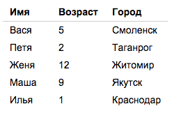

Плагин — это что-то, что расширяет существующий функционал. jQuery работает с DOM, Ajax и имеет раяд утилит. Если нам
нужно расширить существующие возможности, то можно написать плагин.

По этому материалу есть [домашнее задание](./#-homework-).
<span class="more"></span>

Плагин jQuery — это новый метод в объекте jQuery.prototype. Добавляя метод (создавая плагин), мы делаем его доступным
всем jQuery-объектам:

```js
var $element = $('<div>'); // Унаследует все методы jQuery.prototype
```

Задача плагина — работать с коллекцией элементов (что-то с ней делать). Например, `fadeOut`, `addClass` и пр.

`jQuery.fn` это то же самое, что `jQuery.prototype`:

```js
// Где-то в районе 92-й строки исходника jQuery
jQuery.fn = jQuery.prototype = {
    // The current version of jQuery being used
    jquery: version,
```

Подробнее о [прототипах в JS](learn.jquery.com/plugins/).

# Простейший плагин
## Шаг 1: добавление метода в прототип jQuery
Чтобы создать плагин, нужно добавить метод в прототип jQuery. При вызове этого метода на коллекции его `this` как 
раз и бдует этой коллекцией. Соответственно, в нем доступны все методы `jQuery.prototype` (например, `.css`):

```js
$.fn.makeItRed = function() {
    console.dir(this);
    this.css('color', 'red');
};
```

## Шаг 2: обеспечение цепочного вызова
Чтобы над jQuery-коллекцией можно было работать и после вызова нашего плагина, нужно вернуть `this`. Так мы обеспечим
работоспособность дальнейших вызовов в цепочке:
 
```js
$.fn.makeItRed = function() {
    this.css('color', 'red');
    return this;
};
$('p').makeItRed().makeItBig();
```
    
## Шаг 3: ограничение области видимости
Разные библиотеки любят использовать `$` для своих нужд. Чтобы не получилось конфликта, мы должны ограничить доступ к
нашему методу извне. Завернем наш код в функциональное выражение:

```js
(function ( $ ) {
 
    $.fn.makeItRed = function() {
        this.css( "color", "red" );
        return this;
    };
 
}( jQuery ));
```
Теперь внутри функционального выражения мы можем создавать переменные с любыми именами и не бояться, что они будут 
использованы во внешнем коде:

```js
(function ( $ ) {
 
    var shade = "#556b2f";
 
    $.fn.greenify = function() {
        this.css( "color", shade );
        return this;
    };
 
}( jQuery ));
```
Подробнее об ограничении области видимости:
* [Модули через замыкания](http://learn.javascript.ru/closures-module)
* [Immediately-Invoked Function Expression (IIFE)](http://benalman.com/news/2010/11/immediately-invoked-function-expression/)

## Шаг 4: минимизация присутствия
Плагин должен иметь минимальное вхождение в прототип. Например, если мы делаем попап, то у него будут методы для 
закрытия и открытия. Сходу можно попробовать сделать нечто подобное:

```js
// Два метода для одного плагина. Плохо.
(function( $ ) {
 
    $.fn.openPopup = function() {
        // Open popup code.
    };
 
    $.fn.closePopup = function() {
        // Close popup code.
    };
 
}( jQuery ));
```

В примере выше в прототип добавляется 2 метода. Так делать не стоит. Лучше добавить один и передавать в него параметры:

```js
(function( $ ) {
 
    $.fn.popup = function( action ) {
 
        if ( action === "open") {
            // Open popup code.
        }
 
        if ( action === "close" ) {
            // Close popup code.
        }
 
    };
 
}( jQuery ));    
```

Это хороший подход для плагина, но это выглядит не красиво с точки зрения ООП. Попап — это объект. У объекта должны быть 
методы, а мы тут передаем какие-то параметры. Однако, так принято в мире jQuery, этот подход оправдан и хорошо 
работает если дело касается расширения существующего функционала.

Как вариант, в этом случае попап, можно сделать объектом и создавать экземпляры через конструктор или воспользоваться
[jQuery widget factory](../jquery-widget-factory).

## Шаг 5: Перебор элементов коллекции
При инициализации плагин получает коллекцию элементов jQuery. Это массив объектов DOM, расширенный методами jQuery.
Если нужно делать что-то с каждым элементом коллекции, то ее можно перебрать с помощью `.each()`:

```js
$.fn.myNewPlugin = function() {
 
    return this.each(function() {
        // Do something to each element here.
    });
 
};
```

В этом примере возвращается результат перебора. Это тот же `this`, поэтому нет смысла возвращать `this` отдельно.

## Шаг 6: опции
Часто нам хочется передавать в плагин какие-то параметры (опции). Для этого используют переопределение объекта с 
опциями по умолчанию:

```js
(function ( $ ) {
 
    $.fn.greenify = function( options ) {
 
        // This is the easiest way to have default options.
        var settings = $.extend({
            // These are the defaults.
            color: "#556b2f",
            backgroundColor: "white"
        }, options );
 
        // Greenify the collection based on the settings variable.
        return this.css({
            color: settings.color,
            backgroundColor: settings.backgroundColor
        });
 
    };
 
}( jQuery ));
```

## Пример
Плагин, который собирает все ссылки и ставит рядом в скобочках их href:

```js
(function( $ ) {
 
    $.fn.showLinkLocation = function() {
 
        this.filter( "a" ).append(function() {
            return " (" + this.href + ")";
        });
 
        return this;
 
    };
 
}( jQuery ));
```

# Более продвинутые техники
## Доступ к дефолтным настройкам
Чтобы разработчики могли установить свое собственное значение по умолчанию и не переопределять его постоянно, нужно 
сделать объект опций свойством функции плагина:

```js
// Plugin definition.
$.fn.highlight = function( options ) {
 
    // Extend our default options with those provided.
    // Note that the first argument to extend is an empty
    // object – this is to keep from overriding our "defaults" object.
    var opts = $.extend( {}, $.fn.highlight.defaults, options );
 
    // Our plugin implementation code goes here.
 
};
 
// Plugin defaults – added as a property on our plugin function.
$.fn.highlight.defaults = {
    foreground: "red",
    background: "yellow"
};
```

Теперь можно сделать так:

```js
// Override plugin default foreground color.
$.fn.highlight.defaults.foreground = "blue";
 
// ...
 
// Invoke plugin using new defaults.
$( ".highlightDiv" ).highlight();
 
// ...
 
// Override default by passing options to plugin method.
$( "#green" ).highlight({
    foreground: "green"
});
```

## Предоставить доступ к прикладным функциям
Это даст возможность минимальными усилиями изменить поведение плаина:

```js
// Plugin definition.
$.fn.highlight = function( options ) {
 
    // Iterate and reformat each matched element.
    return this.each(function() {
 
        var elem = $( this );
 
        // ...
 
        var markup = elem.html();
 
        // Call our format function.
        markup = $.fn.highlight.format( markup );
 
        elem.html( markup );
 
    });
 
};
 
// Define our format function.
$.fn.highlight.format = function( txt ) {
    return "<strong>" + txt + "</strong>";
};
```

Здесь разработчик сможет переопределить шаблон итоговой разметки на свой собственный. Написать плагин для нашего 
плагина.

Для примера можно взглянуть на код плагина [jQuery Cycle 2](jquery.cycle.js). Там таких методов много. Напирмер, один
из них — `transitions` — отвечает за эффекты. Такая организация кода позволяет удобно делать [расширения для 
плагина](http://malsup.com/jquery/cycle2/download/advanced.php).

## Ограничить доступ к служебным функциям
Открывая доступ к методам, мы, тем самым, обязуемся поддерживать определенную совместимость в будущем. Изменим 
название метода, как-то решим реорганизовать наш код — нарушим совместимость. Таким образом, если нет уверенности, 
что какой-то метод нужно открыть, то лучше оставить его приватным. Это можно сделать через замыкание, обернув код в 
анонимную функцию с вызовом на месте:

```js
// Create closure.
(function( $ ) {
 
    // Plugin definition.
    $.fn.highlight = function( options ) {
        debug( this );
        // ...
    };
 
    // Private function for debugging.
    function debug( obj ) {
        if ( window.console && window.console.log ) {
            window.console.log( "highlight selection count: " + obj.length );
        }
    };
 
    // ...
 
// End of closure.
 
})( jQuery );
```

Метод `debug` останется только внутри функции и будет браться внутренним кодом из замыкания.

<!--
## Ответственная кастомизация

## Не изобретать свой собственный синтаксис

## Дать возможность изменять разметку

## Дать возможность указывать коллбэк-функции

При написании плагина нужно всегда иметь ввиду 3 вещи:
* Гибкость
* Размер
* Производительность
-->

# Материалы
* http://learn.jquery.com/plugins/
* [Признаки плохого плагина](https://remysharp.com/2010/06/03/signs-of-a-poorly-written-jquery-plugin)
* [jQuery Plugin Design Patterns](http://addyosmani.com/resources/essentialjsdesignpatterns/book/#jquerypluginpatterns)


# Домашняя работа [](#homework)
Написать плагин, который позволит сортировать содержимое таблиц по столбцам. Пример решения:


 
Для сортировки значений используется метод `.sort` [массива](http://learn.javascript.ru/array-methods#сортировка-метод-sort-fn).

Сортировать нужно 2 вида значений: строки и числа. Для этого в таблице предусмотрены соответствющие атрибуты:

```html
<table>
    <thead>
        <tr>
            <th data-type="string">Имя</th>
            <th data-type="number">Возраст</th>
            <th data-type="string">Город</th>
        </tr>
    </thead>
    <tbody>
        <tr>
            <td>Вася</td>
            <td>5</td>
            <td>Смоленск</td>
        </tr>
        <!-- ... -->
    </tbody>
</table>

<script>
$('table').sortable();
</script>
```

Сортировку можно сделать только по возрастанию. Если сделаете сортировку и по убыванию, это будет очень хорошо.

<div class="homework-tip">
<span class="homework-tip__handle">Подсказка</span>
<div class="homework-tip__content">
<ol>
<li>Для начала <a href="http://learn.javascript.ru/array-methods#сортировка-метод-sort-fn">изучите</a>, как работает 
метод `sort`.</li>
<li>Создайте из строк таблицы массив, его нужно будет отсортировать.</li>
<li>Напишите свою сортировочную функцию для метода `sort`, которая бы получала для сравнения две строки таблицы, 
доставала бы из них нужные значения и сравнивала бы их между собой. Если этот пункт не понятен, см. пункт №1.</li>
<li>Отсортируйте массив строк и вставье их в таблицу.</li>
</ol>
</div>
</div>
