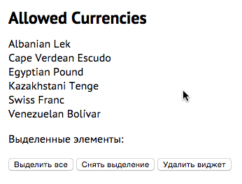

Если нам нужен компонент, который будет менять состояния, взаимодействовать с другими компонентами, 
включаться/отключаться и т. д., то плагины могут быть не слишком удобны в использовании. Для таких случаев придумали
jQuery Widget Factory.
<span class="more"></span>

Плагины нужны, чтобы расширить существующий функционал фреймворка. Обычно они запускаются на коллекции, что-то с ней 
делают и возвращают эту же коллекцию, обеспечивая цепочность вызовов.

Обычно jQuery-плагины применяются без настроек и результат их выполнения всегда одинаков.

`$('div').text('Hello')` — для такого рода операций плагин — самое то. `.text()` добавляет текст в элемент и на этом 
его работа заканчивается.

Если нам нужно произвести инициализацию компонента, следить за его [состоянием](http://en.wikipedia.org/wiki/State_%28computer_science%29) и изменять 
его в зависимости от разлиынх условий, то тут потребуется писать код, типичный для многих таких 
виджетов. Разные авторы могут по-разному подходить к реализации своих API. Это влечет снижение консистентности кода и
 лишние затраты времени.

Для того, чтобы создавать более ООП-ориентированные сущности и в то же время быть в среде jQuery придумали [jQuery 
Widget Factofy](http://jqueryui.com/widget/), которая является частью jQuery UI и может быть использована отдельно 
(7Кб в сжатом виде). 


## Widget factory
Widget factory предоставляет ряд соглашений и готового функционала для того, чтобы написание виджетов было однотипным и 
получаемый API работал одним образом. Сохраняем время на рутинных операциях (инициализация, дестрой, триггеринг 
событий) используем соглашения для приватных и публичных метоодов, получаем более более качественный результат и 
экономим время. Научились использовать один виджет из jQuery UI — умеем пользоваться всеми.

В Magento 2.0 Widget Factory [является стандартом](http://devdocs.magento.com/guides/v2.0/coding-standards/code-standard-jquery-widgets.html) для создания компонентов интерфейса.

## Консистентность кода
jQuery Widget Factory прежде всего решает задачу по организации кода. Следование соглашениям в команде позволяет не 
тратить время, раздумывая над API виджета при разработке и над вызовом методов, установкой свойств при использовании.

## Преимущества
* Наследование и полиморфизм
* Конструктор/Деструктор `_create`/`_destroy`
* Псевдоселектор `$(':ns-plugin')`
* Приватные и публичные методы
* Механизм колбэков (`_trigger`)

## Соглашения
* Создание и удаление виджетов;
* Установка и получение опций (геттеры и сеттеры);
* Вызов методов;
* Прослушивание и вызов событий, которые инициирует виджет.

Состояние объекта — набор данных о нем в текущий момент времени: значение (проценты в прогрессбаре), открыт он или 
закрыт, какой пункт выделеин и т. д.

Виджеты имеют жизненный цикл — от инициализации до дестроя.

Инициализация прогрессбара:

```js
// Без параметров, с дефолтными настройками
$( "#elem" ).progressbar();
// Со своими параметрами
$( "#elem" ).progressbar({ value: 20 });
```

Параметры — часть состояния виджета. Их мы можем менять в течение жизненного цикла через метод [`option`](http://api.jqueryui.com/jQuery.widget/#method-option).

## Параметры при инициализации
Для плагина хорошая практика — набор дефолтных опций и предоставление внешнего интерфейса к ним:

```js
$.fn.plugin = function( options ) {
    options = $.extend( {}, $.fn.plugin.defaults, options );
    // Plugin logic goes here.
};
 
$.fn.plugin.defaults = {
    param1: "foo",
    param2: "bar",
    param3: "baz"
};
```

Здесь мы вручную выносим дефолтные настройки в метод функции, пользуясь тем, что функция — это объект.

`$.widget` позволяет это делать даже проще:

```js
$.widget( "ns.plugin", {
 
    // Default options.
    options: {
        param1: "foo",
        param2: "bar",
        param3: "baz"
    },
 
    // Этот методы вызовется при первом обращении к виджету: $('div').widgetName();
    _create: function() {
        // Options are already merged and stored in this.options
        // Plugin logic goes here.
    }
 
});
```

Мы из коробки имеем смерженные дефолтные и юзерские параметры и доступ к ним извне.

# Методы
После инициализации виджета мы можем следить за его состоянием, менять его и выполнять с помощью виджета какие-то 
действия. Выполнить действие — запустить метод. Метод запускается так:

```js
$( "#elem" ).progressbar( "value" ); // Геттер
$( "#elem" ).progressbar( "value", 40 ); // Сеттер (передали параметр)

// При таком вызове метода (а-ля плагин) виджет возвращает jQuery object, так что можно
// продолжать цепочку вызовов:
$( "#elem" )
    .progressbar( "value", 90 )
    .addClass( "almost-done" );
```

## Общие методы
Некоторые методы идут из коробки.

**option** позволяет установить параметр после инициализации виджета:

```js
// Получить значение (геттер)
$( "#elem" ).progressbar( "option", "value" );

// Установить значение (сеттер)
$( "#elem" ).progressbar( "option", "value", 30 );

// Перезаписать сразу несколько параметров
$( "#elem" ).progressbar( "option", {
    value: 100,
    disabled: true
});
```

Получение и установка значений следует синтаксису jQuery core. Например, `$('div').css()`. Отличие в том, что в 
виджет передается еще одни параметр — имя метода.

**disable** — метод для отключения виджета. Например, прогрессбар становится серым и перестает изменяться.

```js
$( "#elem" ).progressbar( "disable" );
$( "#elem" ).progressbar( "option", "disabled", true ); // Эквивалентный синтаксис
```

**enable** — метод включения виджета (выключение отключения &uarr;):

```js
$( "#elem" ).progressbar( "enable" );
$( "#elem" ).progressbar( "option", "disabled", false ); // Эквивалентный синтаксис
```

**destroy** — грохнуть виджет, закончить его жизненный цикл:

```js
$( "#elem" ).progressbar( "destroy" );
```

После удаления виджета работать с ним нельзя. Надо работать — инициализируем заново. При вызове `.remove()` у 
элемента виджета, при изменении `.html()` или вызове `.empty()` у родителей `destroy` вызывается автоматически.

**widget** вернет сгенерированную виджетом разметку. Если таковой нет, то вернется исходный элемент:

```js
$( "#elem" ).progressbar( "widget" );
```

# События
Видеты могут триггерить события при изменении состояния. Обычно к именам событияй виджета добавляется префикс — 
название виджета:

```js
$( "#elem" ).on( "progressbarchange", function() {
    alert( "The value has changed!" );
});
```

Каждому событию соответствует коллбэк, который мы можем переопределить:

```js
$( "#elem" ).progressbar({
    change: function() {
        alert( "The value has changed!" );
    }
});
```

## Общие события
У всех виджетов уже есть событие `create`, которое сработает при создании виджета.
  

# Написание виджета
Рассмотрим написание виджета на примере [прогрессбара](http://jqueryui.com/progressbar/).

В метод `$.widget` передается 2 параметра: имя плагина и объект с его функционалом. Widget factory создаст 
конструктор и будет использовать переданный объект как прототип для него. Весь дефолтный функционал будет браться из 
`jQuery.Widget.prototype`. У плагина контекст (`this`) — это DOM-элемент, у виджета контекст — единичный экземпляр 
объекта:

```js
$.widget( "nmk.progressbar", { // nmk — namespace, progressbar - widget name
 
    _create: function() {
        var progress = this.options.value + "%";
        this.element.addClass( "progressbar" ).text( progress );
    }
 
});
```    

При создании, экземпляр виджета сохраняется в `.data` DOM-объекта:

```js
var bar = $( "<div />")
    .appendTo( "body" )
    .progressbar()
    .data( "nmk-progressbar" );
 
// Call a method directly on the plugin instance.
bar.option( "value", 50 );
 
// Access properties on the plugin instance.
alert( bar.options.value );
```

Widget Factory позволяет работать с прототипом всех созданных сущностей. Добавляя новые методы, они становятся 
доступны всем эзкемплярам:

```js
$.nmk.progressbar.prototype.reset = function() {
    this._setOption( "value", 0 );
};
```

## Соглашения
Пространство имен: имя плагина начинается с неймспейса, далее следует точка и после точки идет имя плагина:
`nmk.progressbar`. Неймспейс `ui` занят компонентами библиотеки jQuery UI. Нам следует использовать свое собственное 
пространство имен.

`this.element` — объект jQuery (единичный). Если Widget Factory, вызывается на коллекции элементов, то для каждого 
элемента создается _свой собственный_ экземляр. Эти экземпляры унаследуют методы и свойства от одного прототипа.
 
`this.options` — объект с опциями, которые переданы при инициализации.

Значения по умолчанию (опции и коллбэки) мы можем обозначить как объект `options`:

```js
$.widget( "nmk.progressbar", {
 
    // Default options.
    options: {
        value: 0,
        
        callback: null // Callbacks are also here
    },
 
    _create: function() {
        var progress = this.options.value + "%";
        this.element.addClass( "progressbar" ).text( progress );
    }
 
});
```

Widget factory предоставляет удобные способ управления состоянием плагина и соглашение по выполнению частых задач, 
типа работы с приватными и внешними методами.


## Добавление методов
Мы можем добавить методы в наш объект, в том числе приватные, начав их имена с подчеркивания. Снаружи они будут 
недоступны:

```js
$.widget( "nmk.progressbar", {
    options: {
        value: 0
    },
 
    _create: function() {
        var progress = this.options.value + "%";
        this.element.addClass("progressbar").text( progress );
    },
 
    // Create a public method.
    value: function( value ) {
 
        // No value passed, act as a getter.
        if ( value === undefined ) {
 
            return this.options.value;
 
        // Value passed, act as a setter.
        } else {
 
            this.options.value = this._constrain( value );
            var progress = this.options.value + "%";
            this.element.text( progress );
 
        }
 
    },
 
    // Create a private method.
    _constrain: function( value ) {
 
        if ( value > 100 ) {
            value = 100;
        }
 
        if ( value < 0 ) {
            value = 0;
        }
 
        return value;
    }
 
});
```

Для вызова методов нужно передать параметр в виджет. Если нужно установить значение, то передаем его следом:

```js
var bar = $( "<div />" ).appendTo( "body").progressbar({ value: 20 });
 
// Get the current value.
alert( bar.progressbar( "value" ) );
 
// Update the value.
bar.progressbar( "value", 50 );
 
// Get the current value again.
alert( bar.progressbar( "value" ) );
```

Это не самый удобный способ работы. Так сделано для того, чтобы по-минимуму воздействовать своими методами на объект 
`$`.

## Работа с опциями
Widget Factory предоставляет возможность работы с опциями. С помощью метода `option()` можно получать и устанавливать
опции после инициализации используя его как геттер и сеттер. В него можно передавать единичные мараметры или срзау 
объект.

При установке опций вызывается метод `_setOption` для каждого передаваемого свойства. Этот метод мы можем указать 
руками, чтобы контролировать установку опций.

Если нам нужно что-то сделать со всей пачкой передаваемых опций, в нашем распоряжении имеетс метод `_setOptions`.

````js
$.widget( "custom.progressbar", {
    options: {
        value: 0
    },
    _create: function() {
        this.options.value = this._constrain(this.options.value);
        this.element.addClass( "progressbar" );
        this.refresh();
    },
    _setOption: function( key, value ) {
        if ( key === "value" ) {
            value = this._constrain( value );
        }
        this._super( key, value );
    },
    _setOptions: function( options ) {
        this._super( options );
        this.refresh();
    },
    refresh: function() {
        var progress = this.options.value + "%";
        this.element.text( progress );
    },
    _constrain: function( value ) {
        if ( value > 100 ) {
            value = 100;
        }
        if ( value < 0 ) {
            value = 0;
        }
        return value;
    }
});
````

## Callbacks
Для того, чтобы реагировать на изменение состояния нашего виджета предусмотрен механизм работы с колбэк-функциями. В 
прмере ниже с помощью метода `_trigger` вызывается метод `complete`, который сработает, когда значение прогрессбара 
достигнет 100%.

```js
$.widget( "custom.progressbar", {
    options: {
        value: 0
    },
    _create: function() {
        this.options.value = this._constrain(this.options.value);
        this.element.addClass( "progressbar" );
        this.refresh();
    },
    _setOption: function( key, value ) {
        if ( key === "value" ) {
            value = this._constrain( value );
        }
        this._super( key, value );
    },
    _setOptions: function( options ) {
        this._super( options );
        this.refresh();
    },
    refresh: function() {
        var progress = this.options.value + "%";
        this.element.text( progress );
        if ( this.options.value == 100 ) {
            this._trigger( "complete", null, { value: 100 } ); // вызов колбэка и триггеринг события
        }
    },
    _constrain: function( value ) {
        if ( value > 100 ) {
            value = 100;
        }
        if ( value < 0 ) {
            value = 0;
        }
        return value;
    }
});
```

Метод `_trigger` принимает 3 параметра: имя колбэка, объект события jQuery и объект данных. Колбэк-функция — это один
из параметров. Ее можно получать и вызывать как обычные опции. На ряду с колбэк-функций триггериться и событие. Имя 
события получается из объединения имени виджета и колбэк-функции: `progressbarcomplete`.

```js
var bar = $( "<div></div>" )
    .appendTo( "body" )
    .progressbar({
        complete: function( event, data ) {
            alert( "Callbacks are great!" );
        }
    })
    .bind( "progressbarcomplete", function( event, data ) {
        alert( "Events bubble and support many handlers for extreme flexibility." );
        alert( "The progress bar value is " + data.value );
    });
 
bar.progressbar( "option", "value", 100 );
```

# Как работает Widget Factory
Вызов `$.widget('namespace.widgetname', widgetObject)` создает конструктор и устанавливает его прототипом 
передаваемый `widgetObject`. Таким образом все создаваемые сущности унаследуют от `widgetObject`.

Сам объект унаследует дефолтный функционал от `jQuery.Widget.prototype` (Widget с большой буквы).

Для примера можно рассмотреть http://jqueryui.com/resources/demos/progressbar/default.html

Запустив в консоли `$.ui.progressbar.prototype` можно увидеть объект, от которого виджет наследует методы и свойства
присущие ему из коробки.

При создании виджета ссылка на его объект содержится в `jQuery.data` DOM-элемента. На той же странице можно 
посмотреть `$( "#progressbar" ).data('uiProgressbar')` и его `__proto__`. А раз так, то мы можем записать ее в 
переменную и обращаться к методам и свойсвтам через точку, а не передавая в скобках названия:

```js
var bar = $( "<div></div>" )
    .appendTo( "body" )
    .progressbar()                 // Инициализировали виджет
    .data( "custom-progressbar" ); // Достали и сохранили в bar ссылку на объект виджета
 
// Call a method directly on the plugin instance.
bar.option( "value", 50 );
 
// Access properties on the plugin instance.
alert( bar.options.value );
```

Так же можно вызывать конструктор виджета напрямую:

```js
var bar = $.custom.progressbar({},       // возможные опции
    $( "<div></div>" ).appendTo( "body") // элемент виджета
);
 
// Same result as before.
alert( bar.options.value );
```

## Добавление/изменение методов в прототипе виджета
Поскольку в виджете мы работаем с конструктором и прототипом (в плагине мы не имеем таких возможностей), то мы можем 
легко расширять его функционал: добавлять новые методы или изменять существующие:

```js
// Добавим метод для сбрасывания значения прогрессбара
$.custom.progressbar.prototype.reset = function() {
    this._setOption( "value", 0 );
};
```

# Дестрой
Для того, чтобы удалить виджет и почистить за собой существует метод `_destroy`. Из коробки он удаляет ссылку на 
объект из `jQuery.data` элемента, отключает все события из неймспейса виджета.

Метод `_destroy()` вызывается с помощью открытого метода `destroy()`. Мы сами можем добавить в него нужный функционал:

```js
$.widget( "custom.progressbar", {
    options: {
        value: 0
    },
    _create: function() {
        this.options.value = this._constrain(this.options.value);
        this.element.addClass( "progressbar" );
        this.refresh();
    },
    _setOption: function( key, value ) {
        if ( key === "value" ) {
            value = this._constrain( value );
        }
        this._super( key, value );
    },
    _setOptions: function( options ) {
        this._super( options );
        this.refresh();
    },
    refresh: function() {
        var progress = this.options.value + "%";
        this.element.text( progress );
        if ( this.options.value == 100 ) {
            this._trigger( "complete", null, { value: 100 } );
        }
    },
    _constrain: function( value ) {
        if ( value > 100 ) {
            value = 100;
        }
        if ( value < 0 ) {
            value = 0;
        }
        return value;
    },
    _destroy: function() {
        this.element
            .removeClass( "progressbar" )
            .text( "" );
    }
});
```

# Особенности вызова методов
Widget factory создает и плагин и экземпляр объекта. Мы можем вызывать методы используя эти два подхода.

## Вызов метода из плагина
```js
$( ".selector" ).dialog( "close" );
$( ".selector" ).dialog( "option", "height" ); // вызов метода с параметром (получаем высоту)
```

## Вызов метода из объекта
По скольку каждый экземпляр каждого виджета храниться в `jQuery.data`, то мы можем просто доставать методы по ссылке:

```js
var dialog = $( ".selector" ).data( "ui-dialog" ); // сохраняем ссылку на объект
dialog.close(); // вызываем методы напрямую
```

Можно и так, с помощью метода `instance` (работает в jQuery UI 1.11):

```js
$( ".selector" ).dialog( "instance" ).close();
```

## Возвращаемые значения
Когда мы используем вызов метода как из плагина, то возвращается jQuery-объект и мы можем продолжить цепочку. 
Исключение — методы, которые возвращают информацию о состоянии виджета:
 
```js
var dialog = $( ".selector" ).dialog();
 
// Plugin invocation - returns a jQuery object
dialog.dialog( "close" );

// Therefore, plugin method invocation makes it possible to
// chain method calls with other jQuery functions
dialog.dialog( "close" )
    .css( "color", "red" );

// Запрашиваем информацию о состоянии виджета. jQuery-объект не вернется:
$( ".selector" )
    .dialog( "isOpen" )
    // This will throw a TypeError
    .css( "color", "red" );

```    

Когда мы вызываем метод из экземпляра, то вернется `undefined`:

```js
// Instance invocation - returns undefined
dialog.data( "ui-dialog" ).close();
```

# Расширение функционала существующих виджетов
Иногда нужно что-то подкрутить в существующем виджете или сделано новый на его основе. Обычно виджеты создаются 
фукнций `$.wiget`, которая получает два параметра: название виджета с нейспейсом и прототипный объект. Однако, если 
передать вторым параметром конструктор другого виджета, то он будет взят за основу:

```js
$.widget( "custom.superDialog", {} );              // создание нового виджета без наследования
$.widget( "custom.superDialog", $.ui.dialog, {} ); // за основу будет взят $.ui.dialog
```

В объекте, который передается третьим параметром мы можем переопределять или задавать собственные методы:

```js
$.widget( "custom.superDialog", $.ui.dialog, {
    red: function() {
        this.element.css( "color", "red" );
    }
});
 
// Create a new <div>, convert it into a superDialog, and call the red() method.
$( "<div>I am red</div>" )
    .superDialog()
    .superDialog( "red" );
```

## Расширение существующим методов
Если в новом виджете создать метод с названием таким же, как у родительского, то мы его просто перетрем:

```js
$.widget( "custom.superDialog", $.ui.dialog, {
    open: function() { // Был такой метод в $.ui.dialog, теперь его нету, только вывод в консоль
        console.log( "open" );
    }
});
 
// Create a new <div>, and convert it into a superDialog.
$( "<div>" ).superDialog();
```

Зачастую нам не нужно переписывать существующие мтоды, нам нужно их расширять. Это можно сделать с помощью методов 
`_super()` и `_superApply()`, которые вызовут одноименный метод из прототипного объекта:

```js
$.widget( "custom.superDialog", $.ui.dialog, {
    open: function() {
        console.log( "open" );
 
        // Invoke the parent widget's open(). Теперь все будет работать.
        return this._super();
    }
});
 
$( "<div>" ).superDialog();
```

`_super` и `_superApply` отличаются так же, как `call()` и `apply()` для функций: первый получает список аргументов, 
второй — массив аргументов.

```js
$.widget( "custom.superDialog", $.ui.dialog, {
    _setOption: function( key, value ) {
 
        // Both invoke dialog's setOption() method. _super() requires the arguments
        // be passed as an argument list, _superApply() as a single array.
        this._super( key, value );
        this._superApply( arguments );
    }
});
```

## Переопределение виджетов
Мы можем полностью переопределить виджет (не создавая новый) задав такое же имя, как и у прототипа:

```js
$.widget( "ui.dialog", $.ui.dialog, { // Не будем создавать новый, будем расширять текущий
    open: function() {
        console.log( "open" );
        return this._super();
    }
});
 
$( "<div>" ).dialog();
```

## Переопределение методов в отдельных экземплярах
Для этого пользуемся обычной JS-нотацией для объектов:

```js
var dialogInstance = $( "<div>" )
    .dialog()
    .data( "ui-dialog" ); // Retrieve the dialog's instance and store it.
 
// Override the close() method for this dialog
dialogInstance.close = function() {
    console.log( "close" );
};
 
// Create a second dialog
$( "<div>" ).dialog();
 
// Select both dialogs and call close() on each of them.
// "close" will only be logged once.
$( ":data(ui-dialog)" ).dialog( "close" );
```

# Материалы
* https://learn.jquery.com/jquery-ui/
* http://learn.jquery.com/plugins/stateful-plugins-with-widget-factory/
* http://api.jqueryui.com/jQuery.widget
* http://devdocs.magento.com/guides/v2.0/coding-standards/code-standard-jquery-widgets.html
* http://ajpiano.com/widgetfactory
* http://www.slideshare.net/magentodev/take-more-from-jquery

# Домашняя работа [](#homework)
Задача — реализовать список с выделением, используя Widget Factory.

* Клик на элементе списка выделяет только его.
* Ctrl (Cmd) + клик добавляет/убирает элемент из выделенных. 
* Shift + клик добавляет промежуток от последнего кликнутого к выделению. 



Нужно реализовать API виджета, чтобы можно было получить массив индексов выделенных элементов, выделить все элементы 
и снять выделение полностью.

Не забываем про деструктор. Нужно дать возможность разработчикам почистить за собой, когда виджет будет не нужен.

Обратите внимание на работу с событиями и метод [`_on`](http://api.jqueryui.com/jQuery.widget/#method-_on). 

Возможно, пригодиться вспомнить некоторые [CSS-селекторы](http://learn.javascript.ru/css-selectors), но можно и без 
них. 

Примерный код:
```js
var selectable = $('#currencies').selectable({
    selected: function (e, data) {
        $('#selectedItems').text(data.selectedItems.join(', '));
    }
}).data('am-selectable');

// selectable.someMethod('someParameter');
// selectable.destroy();
```
