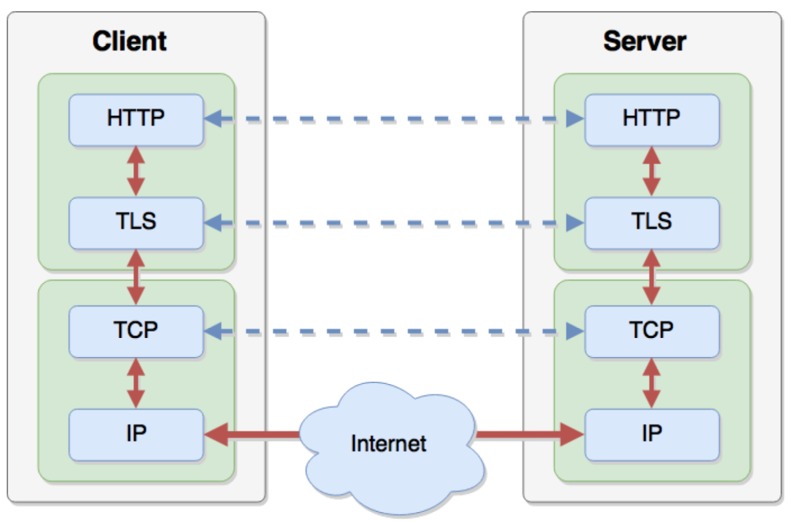
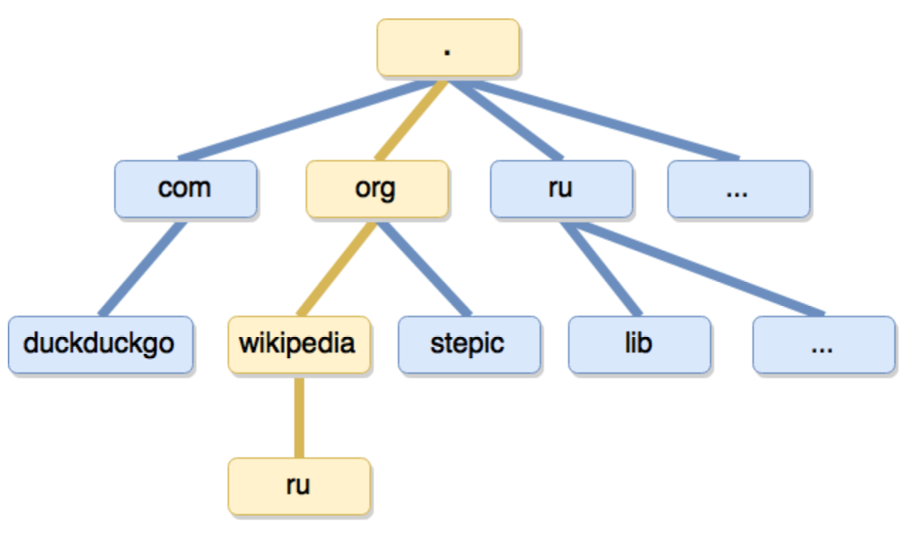
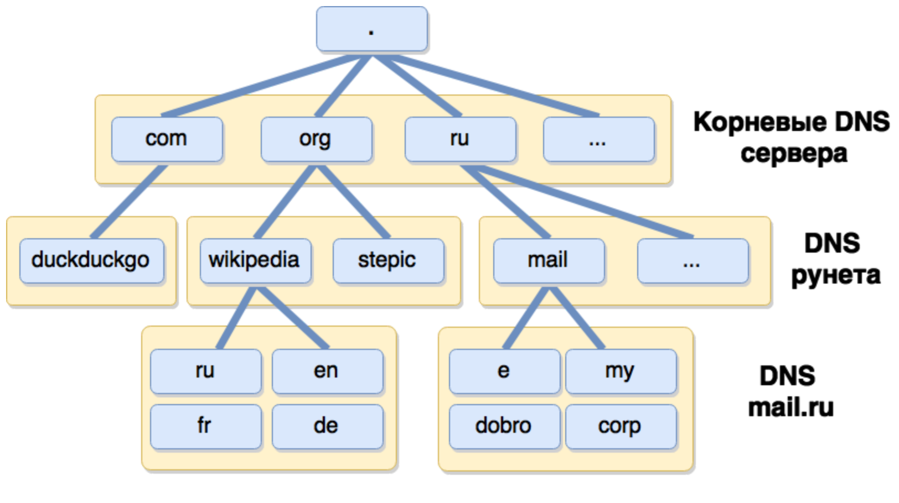
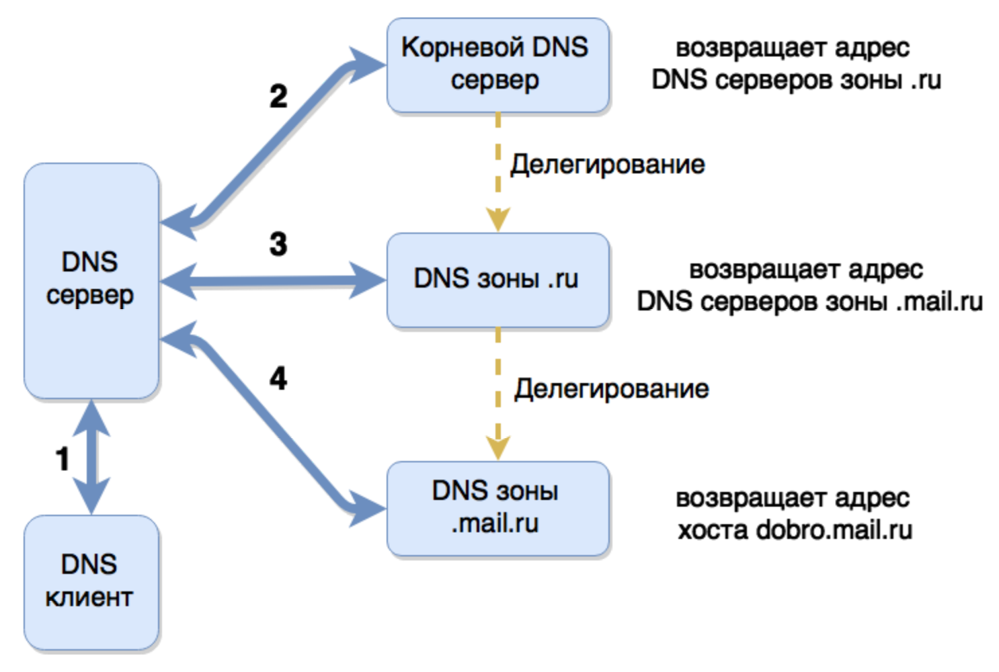
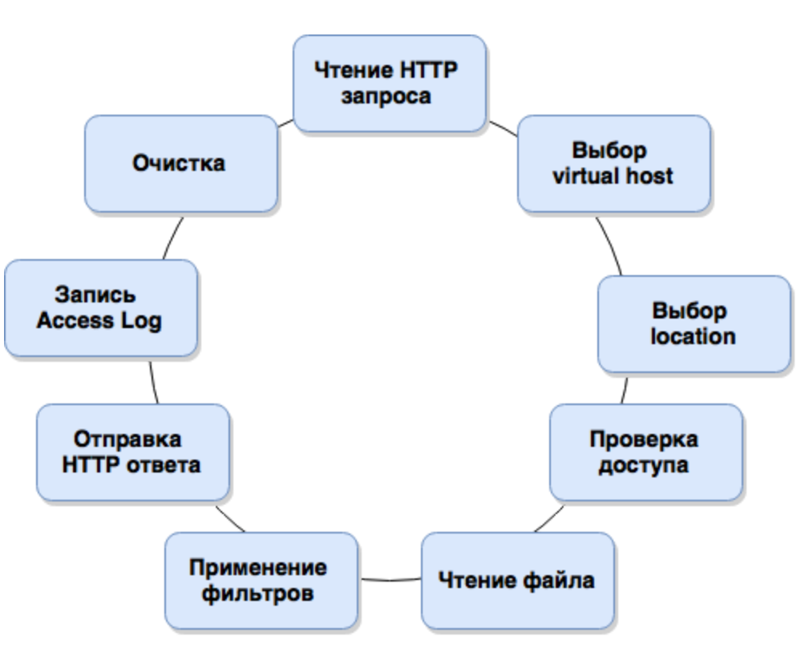

# Сетевые протоколы
[Раздел](https://stepik.org/lesson/%D0%A1%D0%B5%D1%82%D0%B5%D0%B2%D1%8B%D0%B5-%D0%BF%D1%80%D0%BE%D1%82%D0%BE%D0%BA%D0%BE%D0%BB%D1%8B-14823/step/2?course=Web-%D1%82%D0%B5%D1%85%D0%BD%D0%BE%D0%BB%D0%BE%D0%B3%D0%B8%D0%B8&unit=4172)

## Что происходит при HTTP-запросе
Службы и сервисы, задействованные при работе с HTTP:

* Браузер анализирует введенный URL и извлекает имя хоста
* Используя систему DNS, браузер преобразует домен в ip адрес
* Устанавливает TCP соединение с web-сервером
* Если протокол https, устанавливает TLS соединение поверх TCP
* Формирует HTTP запрос, отправляет его, HTTP ответ
* Браузер закрывает соединение (для HTTP/1.0)
* Далее процесс парсинга и отображения документа

Сетевые протоколы объединяются в стэк: одни предоставляют свои возможности другим:



Client HTTP/TLS — браузер
Client TCP/IP — ОС пользователя

Server HTTP/TLS — веб-сервер
Server TCP/IP — ОС сервера

Синие пунктирные стрелки — это не фактические вызовы. Мы не можем напрямую обратится к HTTP-сервера от клиента. Нужно спуститься по иерархии протоколов до IP (на самом деле еще ниже, IP это тоже надстройка над более низкоуровневыми протоколами).

Говоря, что данные передаются по HTTP, мы подразумеваем, что используется стек протоколов.

### DNS
DNS (Domain Name System) - это распределенная база данных, хранящая информацию о доменах, в первую очередь отображение доменных имен на IP
адреса машин, обслуживающих эти домены.

DNS — пожалуй, самая высоконагруженная база данных в мире. Она распределена по многим серверам (разделена на части для снижения нагрузки).

Пространство доменных имен:


`.` — самый корневой домен. Его обычно опускают в адресах.

База DNS разделена на зоны. Каждая зона обслуживается
одной организацией:



Обработка DNS-запроса. Преобразование DNS в IP-адрес — это одна из функций ОС. Для этого в ОС нужен настроенный DNS-сервер в настройках интернета (зачастую предоставляет провайдер).



Для получения IP-адреса `dobro.mail.ru` мы спрашиваем DNS-сервер провайдера. Он, в свою очередь, спрашивает корневой DNS-сервер (`2`), тот отдает ему адрес сервера `.ru`. Потом спрашиваем `.ru` и тот отдает адрес `mail.ru`. Спрашиваем `main.ru` и уже он отдает DNS-серверу провайдера IP-адрес `dobro.mail.ru`.

То есть каждый DNS-сервер знает только про следующий уровень.

Работает механизм кеширования на разных уровнях DNS-серверов, чтобы каждый раз не дергать корневой сервер и всю последовательность.

DNS-сервер возвращает:
* Адрес IPv4 или адрес IPv6. Смотря что прописано в базе DNS-сервера.
* Адреса DNS-серверов, обслуживающих данную зону (NS)
* Адреса почтовых серверов для данного домена (MX)

Пример маршрута между DNS-серверами разного уровня: `traceroute ya.ru`

В файле `/etc/hosts` мы можем переопределить адрес DNS любых доменов. Постоянно используется для локальной разработки.

### TCP
[Видео](https://stepik.org/lesson/%D0%A1%D0%B5%D1%82%D0%B5%D0%B2%D1%8B%D0%B5-%D0%BF%D1%80%D0%BE%D1%82%D0%BE%D0%BA%D0%BE%D0%BB%D1%8B-14823/step/4?course=Web-%D1%82%D0%B5%D1%85%D0%BD%D0%BE%D0%BB%D0%BE%D0%B3%D0%B8%D0%B8&unit=4172)

IP не реализует передачу данных без потерь и способен передавать данные только между машинами, но не между программами.

TCP - протокол, обеспечивающий надежную последовательную доставку данных. Фактически, TCP предоставляет интерфейс, похожий на файловый ввод/вывод для сетевых соединений.

* Надежная доставка (убеждается, что все доставил, а не просто передает)
* Полнодуплексная передача (и от клиента к серверу и от сервера клиенту)
* Контроль потока - защита от переполнения

#### Порты
TCP порт — это «адрес» сетевого соединения в пределах одного хоста. TCP порты позволяют поддерживать множество открытых соединений на одной машине.

Номер порта — целое число, не больше 65535. Порты ниже 1024 требуют привилегий суперпользователя.

Порты решают задачу передачу данных для конкретной программы, а не просто машине. Каждый порт связан с конкретной программой, ОС про это знает и все данные, которые передаются на этот порт, попадут в эту программу.

Исторически некоторые порты закреплены за определенными службами:

* 20, 21 - FTP
* 22 - SSH
* 25 - SMTP
* 80 - HTTP
* 443 - HTTPS

Сокет — это IP-адрес с портом («гнездо», соответствующее адресу и порту). Сокеты могут быть серверные (получатель, который слушает) и клиентские (которые отсылают данные).

Каждый процесс может создать «слушающий» сокет (серверный сокет) и привязать его к какому-нибудь порту операционной системы (в UNIX непривилегированные процессы не могут использовать порты меньше 1024). Слушающий процесс обычно находится в цикле ожидания, то есть просыпается при появлении нового соединения. При этом сохраняется возможность проверить наличие соединений на данный момент, установить тайм-аут для операции и т. д.

## TLS-протокол
[Видео](https://stepik.org/lesson/%D0%A1%D0%B5%D1%82%D0%B5%D0%B2%D1%8B%D0%B5-%D0%BF%D1%80%D0%BE%D1%82%D0%BE%D0%BA%D0%BE%D0%BB%D1%8B-14823/step/5?course=Web-%D1%82%D0%B5%D1%85%D0%BD%D0%BE%D0%BB%D0%BE%D0%B3%D0%B8%D0%B8&unit=4172)

TLS (Transport Layer Security, ранее SSL) - криптографический протокол, обеспечивающий безопасную передачу данных между хостами в Internet.

TCP обеспечивает надежную доставку (ничего не потеряется), TLP обеспечивает безопасную доставку (никто не узнает, что передаем).

* Аутентификация сервера (и клиента)
* Шифрование и сжатие передаваемой информации
* Защита от подмены и проверка целостности сообщений

## Итого по установке соединения
Для того, чтобы получить страничку при вводе урла в браузер нам нужно опросить ряд DNS-серверов (или один, если запрос закэширован), установить TCP-соединение (1 [RTT](https://ru.wikipedia.org/wiki/%D0%9A%D1%80%D1%83%D0%B3%D0%BE%D0%B2%D0%B0%D1%8F_%D0%B7%D0%B0%D0%B4%D0%B5%D1%80%D0%B6%D0%BA%D0%B0)) и часто еще и TLP-соединение (1-2 RTT).

RTT — это время, затраченное на отправку сигнала, плюс время, которое требуется для подтверждения, что сигнал был получен.


# Протокол HTTP

## Назначение
Взаимодействие по HTTP начинается после установки соединения по TCP/TLS.

Hyper Text Transfer Protocol — протокол для передачи гипертекста (HTML).

Многие задачи не решены на уровне TCP и нужен протокол более высокого уровня.

HTTP решает следующие задачи:

* Передача документов (TCP устанавливает потоковую передачу байт. В нем нельзя узнать, когда документ закончился).
* Передача мета-информации (mime-type, размер документа)
* Авторизация
* Поддержка сессий. HTTP работает по принципу "вопрос-ответ". Поэтому нужен какой-то механизм поддержки состояния. Клиент может получать данные каждый раз с разных серверов. Чтобы рассказать, что клиент "свой" данные передаются в заголовках запросов.
* Кеширование документов (стили, скрипты, шрифты, картинки и пр.)
* Согласование содержимого (negotiation)
* Управление соединением. TCP можно только закрыть, в HTTP можно более гибко управлять: закрыть, оставить.

## HTTP-запрос
Запрос — это текст. Увидеть можно из консоли: `curl -v ya.ru`:

```bash
> GET /index.html HTTP/1.1
> Host: oggettoweb.ru
> User-Agent: curl/7.43.0
> Accept: */*
>
```

`GET /index.html HTTP/1.1` — строка запроса: метод, урл и версия протокола. `GET` — метод запроса. Говорим серверу, что мы хотим от него.

Далее идут заголовки вида `Ключ: Значение`. Например, `Host: oggettoweb.ru`.

Заголовки могут быть любыми, главное, чтобы они соответствовали [спецификации](https://www.w3.org/Protocols/rfc2616/rfc2616-sec14.html) (не содержали переводов строк и пр.)

После заголовков идет пустая строка. Она отмечает конец заголовков и поле нее может быть тело запроса, если надо.

Запрос — это просто текст, написанный по определенным правилам. В этом легко убедится с помощью утилиты `nc`.

Создадим файл `myget`, в котором запишем запрос:

```
GET /index.html HTTP/1.1
Host: oggettoweb.ru

```

Далее передадим его содержимое в команду `nc`:

```bash
cat myget | nc oggettoweb.ru 80
```

Мы получим документ, который запросили.

Вместо `GET` можно написать `HEAD` и получить только заголовки документа без тела. Подходит для проверки наличия документа, часто используется роботами.

## HTTP-ответ
Ответ — текст, который разбирается клиентами.

```
< HTTP/1.1 200 OK
< Server: nginx
< Date: Tue, 06 Sep 2016 04:42:23 GMT
< Content-Type: text/html
< Content-Length: 10894
< Last-Modified: Fri, 02 Sep 2016 12:07:22 GMT
< Connection: keep-alive
< Vary: Accept-Encoding
< Accept-Ranges: bytes
< 
<!DOCTYPE html>...
```

Клиент и сервер выбирают ту версию HTTP, которая поддерживается обоими. Если клиент работает по HTTP1.1, а сервер понимает только HTTP1.0, то будет использован 1.0.

`HTTP/1.1 200 OK` — 200 — код ответа. Результат операции. ПО ориентируется на число, текст после него больше для человека и особой технической роли не играет.

`Content-Type: text/html` нужен браузеру обязательно. Без него он не отобразит документ. Остальные заголовки не так важны.

Длина документа задается как `Content-Length: 10894`. Соединение при этом можно оставить открытым: `Connection: keep-alive`. Иногда просто считывается, пока соединение не будет закрыто: `Connection: close`.

## Методы HTTP-запросов
Основные:

* `GET` — получить документ.
* `HEAD` — получить только заголовки.
* `POST` — отправка произвольных данных на сервер.

Не так часто используются, как правило отключены на публичных серверах и используются во внутренней логике работы веб-приложения:

* `PUT` - отправка документа на сервер
* `DELETE` - удаление документа
* `CONNECT`, `TRACE`, `OPTIONS` - используются редко
* `COPY`, `MOVE`, `MKCOL` - WebDAV (расширение протокола HTTP, для управления файлами)

## Коды HTTP-ответов
* `1xx` - информационные
* `2xx` - успешное выполнение
    * 200 OK - запрос успешно выполнен
    * 204 No Content - запрос успешно выполнен, но документ пуст
* `3xx` - перенаправления
    * 301 Moved Permanently - документ сменил URL. Документ навсегда перенесен, сервер настроить так, чтобы выдавал 302 и браузер дальше ходит по новому урлу.
    * 302 Found - повторить запрос по другому URL. Документ временно перенесен и кешировать новый урл не надо. Используется для предотвращения повторной отправки форм.
    * 304 Not Modified - документ не изменился, использовать кеш
* `4xx` - ошибка на стороне клиента
    * 400 Bad Request - неправильный синтаксис запроса
    * 401 Unauthorized - требуется авторизация
    * 403 Forbidden - нет доступа (неверная авторизация)
    * 404 Not Found - документ не найден
* `5xx` - ошибка на стороне сервера
    * 500 Internal Server Error - неожиданная ошибка сервера (application)
    * 502 Bad Gateway - проксируемый сервер отвечает с ошибкой
    * 504 Gateway Timeout - проксируемый сервер не отвечает

## Заголовки
С помощью заголовков устанавливаются опции протокола.

Общие для запросов и ответов. Как правило управляют соединением или содержимым тела запроса:

* Content-Type - MIME тип документа
* Content-Length - длина сообщения
* Content-Encoding - кодирование документа, например gzip-сжатие
* Transfer-Encoding - формат передачи, например, chunked
* Connection - управление соединением
* Upgrade - смена протокола

Только в запросах:

* Authorization - авторизация, чаще всего логин/пароль
* Cookie - передача состояния (сессии) на сервер.
* Referer - URL предыдущего документа, контекст запроса
* User-Agent - описание web-клиента, версия браузера
* If-Modified-Since - условный GET запрос
* Accept-* - согласование (negotiation) содержимого

Только в ответах:
* Location - новый URL документа при перенаправлениях
* Set-Cookie - установка состояния (сессии) в браузере
* Last-Modified - дата последнего изменения документа
* Date - Дата на сервере, для согласования кешей
* Server - описание web-сервера, название и версия

Механизм сессии: Юзер авторизуется, после авторизации сервер педает клиенту ключ в `Set-Cookie` и потом клиент этот ключ передает серверу каждый раз при запросах.

## Управление соединением в HTTP1.1
Протокол HTTP/1.0 предполагает закрытие TCP соединения сразу после ответа сервера.

Протокол HTTP/1.1 предполагает удержание TCP соединения, если не было заголовка `Connection: close`.

Соединение должно быть закрыто, если:

* cервер или клиент использует HTTP младше 1.1
* cервер или клиент передал заголовок `Connection: close`
* по истечении таймаута (обычно небольшой, около 10с)

Иначе соединение остается открытым для последующих запросов.

Основная задача такого соединения — загрузить все ресурсы для странички за одно соединение по TCP. Живет оно недолго, порядка 10 секунд. То есть это не полноценное персистентное (постоянное) соединение.
# Веб-сервер
[Видео](https://stepik.org/lesson/Web-%D1%81%D0%B5%D1%80%D0%B2%D0%B5%D1%80%D0%B0-14825/step/2?course=Web-%D1%82%D0%B5%D1%85%D0%BD%D0%BE%D0%BB%D0%BE%D0%B3%D0%B8%D0%B8&unit=4174)

Занимается обработкой протокола HTTP (отдачей документов веб-клиентам).

## Примеры
Apache — самый распространенный. Написан давно, много переписывался (Apache похоже на Patch).

Nginx (эндженикс) — разработал [Игорь Сысоев](https://ru.wikipedia.org/wiki/%D0%A1%D1%8B%D1%81%D0%BE%D0%B5%D0%B2,_%D0%98%D0%B3%D0%BE%D1%80%D1%8C_%D0%92%D0%BB%D0%B0%D0%B4%D0%B8%D0%BC%D0%B8%D1%80%D0%BE%D0%B2%D0%B8%D1%87_(%D0%BF%D1%80%D0%BE%D0%B3%D1%80%D0%B0%D0%BC%D0%BC%D0%B8%D1%81%D1%82)). Используется в Оджетто, более новый продукт. Более легковесный, быстрый и надежный. Быстро набирает популярность.

## Установка
На Маки PHP, Nginx, MySQL устанавливаются с помощью этого скрипта: https://bitbucket.org/patr1ot/memp

После установки доступны алиасы для запуска, остановки и рестарта Nginx:

```
nginx.start
nginx.stop
nginx.restart
```

Веб-сервер — это демон — программа, не связанная с консолью или GUI. Она висит в памяти и обрабатывает данные, которые приходят по сети, через [сокеты](https://ru.wikipedia.org/wiki/%D0%A1%D0%BE%D0%BA%D0%B5%D1%82_(%D0%BF%D1%80%D0%BE%D0%B3%D1%80%D0%B0%D0%BC%D0%BC%D0%BD%D1%8B%D0%B9_%D0%B8%D0%BD%D1%82%D0%B5%D1%80%D1%84%D0%B5%D0%B9%D1%81)) (IP + порт в TCP/IP).

## Запуск
Nginx запускается инит-скриптом. Примерно так: `/etc/init.d/nginx start`. Инит скрипт создается тем, кто выкладывает пакет в пакетный менеджер. Там происходит много всего и нам как пользователям это не интересно.

При запуске демона он читает файл конфигурации (`nginx.conf`). И подтягивает конфиги всех виртуальных хостов.

Далее он получает 80-й порт, который нужен для обработки HTTP. Порты ниже 124 требуют привилегий супер-юзера. Для прослушивания 80-го порта нужно запускать сервер под `sudo` (с привилегиями супер-пользователя).

TODO: Посмотреть про порты, это есть в TCP/IP. 

Сервер пишет логи. Куда — это прописано в конфиге сайтов и дефолтном конфиге сервера.

Далее сервер понижает привилегии, чтобы он работал не от супер-юзера. Он запускает дочерние процессы (воркеры или потоки).

## Файлы, которые использует веб-сервер
Конфиг: `/etc/nginx/nginx.conf`

Как правило в конфиге встречается подключение сторониих файлов:

```nginx
include /etc/nginx/sites-enabled/*
```

При инициализации они тоже становятся частью конфигурации.

Инит-скрипт: `/etc/init.d/nginx [start|stop|restart]`

PID-файл — файл идентификатора процесса: `/var/run/nginx.pid`. Демоны отключаются от консоли после запуска. Этот файл нужен для идентификации процесса демона, чтобы к нему можно было обратится (остановить, перезапустить и пр.).

Error-лог: `/var/log/nginx/error.log` — ошибки сервера. Формат отличается для разных серверов, не формализован.

Access-лог: `/var/log/nginx/access.log` — обработка про обработанные HTTP-запросы. Жесткий формат лога, можно обрабатывать программно.

Логи удобнее задавать для каждого проекта в его же папке.

## Процессы веб-сервера
Выделяются 2 вида процессов: Master и Worker.

Мастер-процесс запускается инит-скриптом под `root`. Мастер-процесс один. Он читает и проверяет конфиг, открывает логи и сокеты (порты), запускает дочерние процессы (воркеры) и управляет ими. После этого мастер-процесс переходит в режим мониторинга.

Воркер запускается с пониженными привилегиями (например, юзер может называется `www-data` или `nobody`). Воркеров может быт столько, сколько нужно для работы сервера (зависит от модели сетевых соединений, которые использует сервер). Они занимаются обработкой входящих запросов.

Бывают дополнительные процессы. Например, кэш-менеджеры, которые следят за очисткой кэша.

## Цикл работы воркер-процессов
Воркер-процессы работают в цикле. На рисунке процесс начинается сверху:



После установки соединения воркер читает HTTP-запрос.

## Модульная архитектура сервера
[Видео](https://stepik.org/lesson/Web-%D1%81%D0%B5%D1%80%D0%B2%D0%B5%D1%80%D0%B0-14825/step/3?course=Web-%D1%82%D0%B5%D1%85%D0%BD%D0%BE%D0%BB%D0%BE%D0%B3%D0%B8%D0%B8&unit=4174)
Nginx нужно скомпилировать с поддержкой модуля, если модуль нужен.

В Апаче модули можно подгружать динамически.

Модуль добавляет директивы в конфиг сервера и регистрирует свои обработчики на этапе цикла работы воркеров.

Пример: `mod_gzip`.

## Конфигурация веб-сервера
[Видео](https://stepik.org/lesson/Web-%D1%81%D0%B5%D1%80%D0%B2%D0%B5%D1%80%D0%B0-14825/step/4?course=Web-%D1%82%D0%B5%D1%85%D0%BD%D0%BE%D0%BB%D0%BE%D0%B3%D0%B8%D0%B8&unit=4174)

* [Частые ошибки в конфигах](https://www.nginx.com/resources/wiki/start/topics/tutorials/config_pitfalls/)

Виртуальный хост (virtual host) — секция конфига, отвечающая за обслуживание определенного домена. Почти всегда сервер обрабатывает несколько разных доменов.

Location — секция конфига, отвечающая за обработку набора урлов. Группа урлов — набор определенного типа документов. Их можно обобщать в этой секции конфига.

```nginx
user www www; # Имя пользователя и группа для воркеров
error_log /var/log/nginx.error_log info; # адрес файла и уровень ошибок

# Эта секция — конфиг веб-сервера.
# Кроме http Nginx может работать как Proxy и как почтовый сервер
http { # Контейнер для настроек всего http-сервера
    include conf/mime.types;
    default_type application/octet-stream;
    log_format simple '$remote_addr $request $status';

    # До этого момента директивы относились ко всем хостам.
    # Далее идут специфичные настройки для доменов: 
    server { # Контейнер для настроек виртуального хоста
        listen 80;

        # Имена доменов
        server_name one.example.com www.one.example.com;

        # Лог-файл для домена
        access_log /var/log/nginx.access_log simple;

        location / { # любой урл
            root /www/one.example.com; # откуда брать файлы
        }

        location ~* ^.+\.(jpg|jpeg|gif)$ { # картинки
            root /www/images; # откуда брать файлы
            access_log off;
            expires 30d;
        }
    }
}
```

## Приоритет урлов в location
Следующие типы location расположены в порядке уменьшения приоритета:

```nginx
location = /img/1.jpg # четкое совпадение
location ^~ /pic/     # приоритетное совпадение по префиксу (начало урла)
location ~* \.jpg$    # по регулярному выражению
location /img/        # совпадение по префиксу
```

Соответственно, в примере `location ~* ^.+\.(jpg|jpeg|gif)$` перебьет `location /`.

При одинаковых приоритетах выбирается `location`, который в конфиге расположен **выше**. Конфиг — это не программа, которая обрабатывается строка-за-строкой. В итоге конфиг превращается в плоскую структуру директив для доменов и последовательность в ней роли не играет.

## Отдача статических документов
Нужно сопоставить урлы из HTTP-запросов с файлами:

```nginx
location ~* ^.+\.(jpg|jpeg|gif|png)$ {
    root /User/amiskov/Sites/project/images;
}

location /sitemap/ {
    alias /home/www/generated;
}
```

Если задан `root`, то путь из урла склеится с `root`:

`/slider/banner.jpg` => `/User/amiskov/Sites/project/images/banner.jpg`


Если задан `alias`, то путь из `location` подменится алиасом:

`/sitemap/index.xml` => `/home/generated/index.xml`

Алиас будет работать только по префиксу. А регуляркой не получится.

## Атрибуты файлов и процессов
После того, как сервер понял, какой файл отдавать, он проверяет права доступа на файловой системе. Если нет прав на отдачу, то будет ошибка с кодом `403`.

У каждого процесса есть свой пользователь и группа.

`ps aux | grep nginx` — посмотреть все запущенные процессы nginx.

У файла (каталога) есть так же пользователь (владелец) и группа. И еще права доступа (read, write, execute).

`ls -la` — показать файловую систему с указанием владельцев и уровней доступа.

Чтобы сервер смог открыть файл, у него должны быть права на чтение файла (`r`) и на исполнение каталога (`x`), где этот файл лежит.

Права распределяются по тройкам `rwxrwxrwx`: user, group, everyone.

Если пользователь процесса совпадает с пользователем (владельцем) файла, то проверяется первая тройка. Иначе проверяется совпадение группы, иначе используется третья тройка.

## Модели обработки сетевых соединений
Apache — изначально prefork. Запускает процессы на каждое соединение. Самый старый сервер, классика. Научился работать в режиме worker (комбинированный) и threads. Написан на C.

Nginx — событийно ориентированный, асинхронный. Написан на C.

NodeJS — событийно ориентированный, асинхронный, на языке высокого уровня. Относительно медленнее Nginx, но очень легко интегрируемый и расширяемый в контексте приложений на JS.


